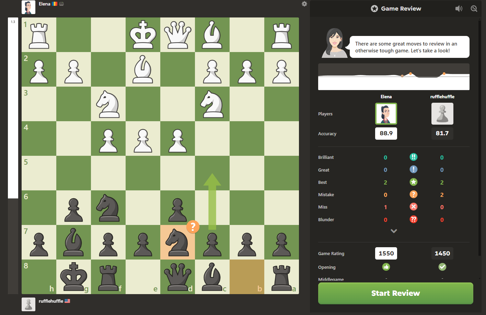
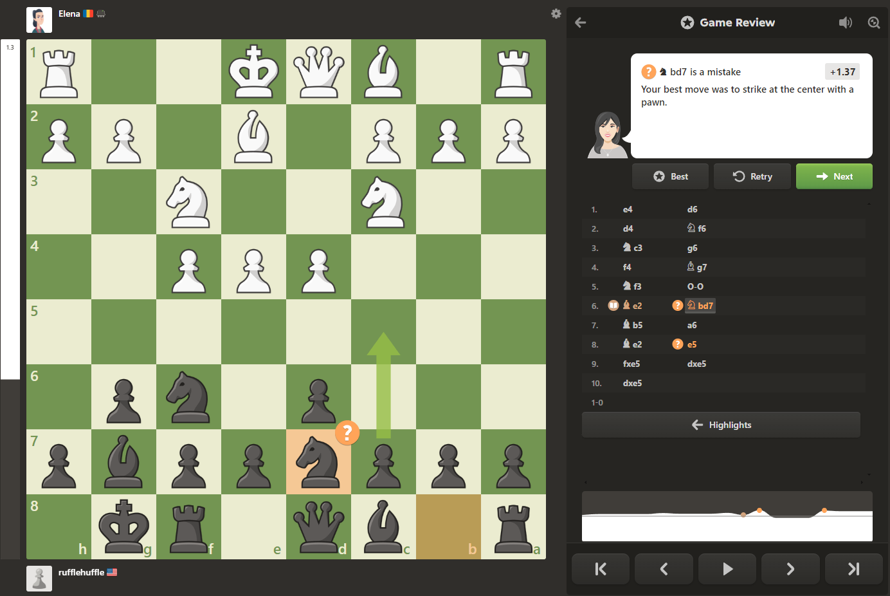
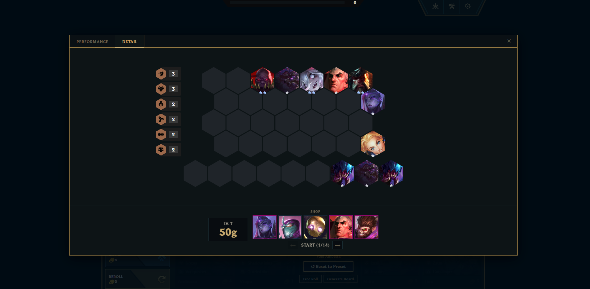

# Round Review

Post rolldown tab that shows mistakes the player made during their rolldown and how to improve them.

## Layout
### Chess
See chess.com's game review layout / styling for inspiration.

Things I like:
- Continuous performance graph
- Color-coded mistakes by severity
- Key moment highlights

### Current Layout

## TODO
- Animate moves between key moments

## ISSUES
- Board changes size between 1st keyframe to 2nd in round review?
- Trait panel should not overflow on the left
- Stats also move with trait panel